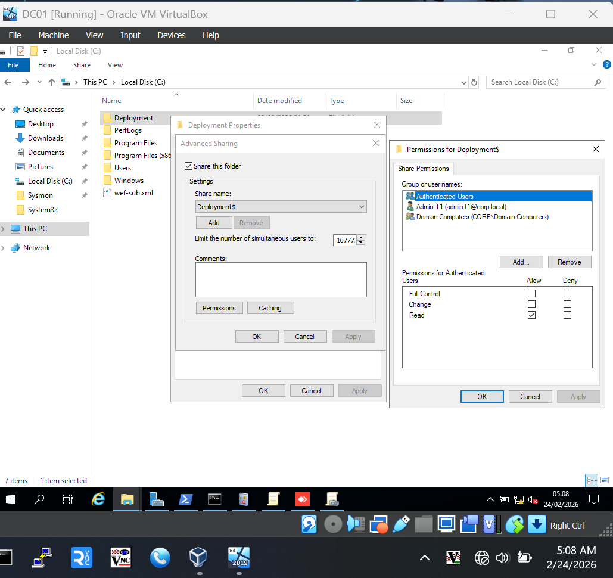
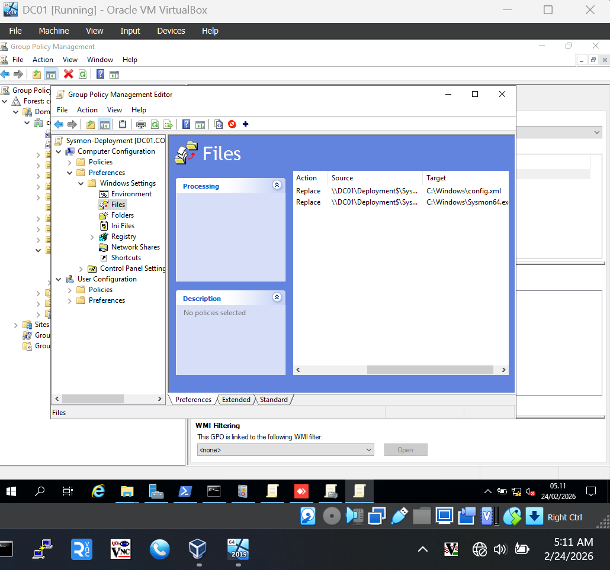
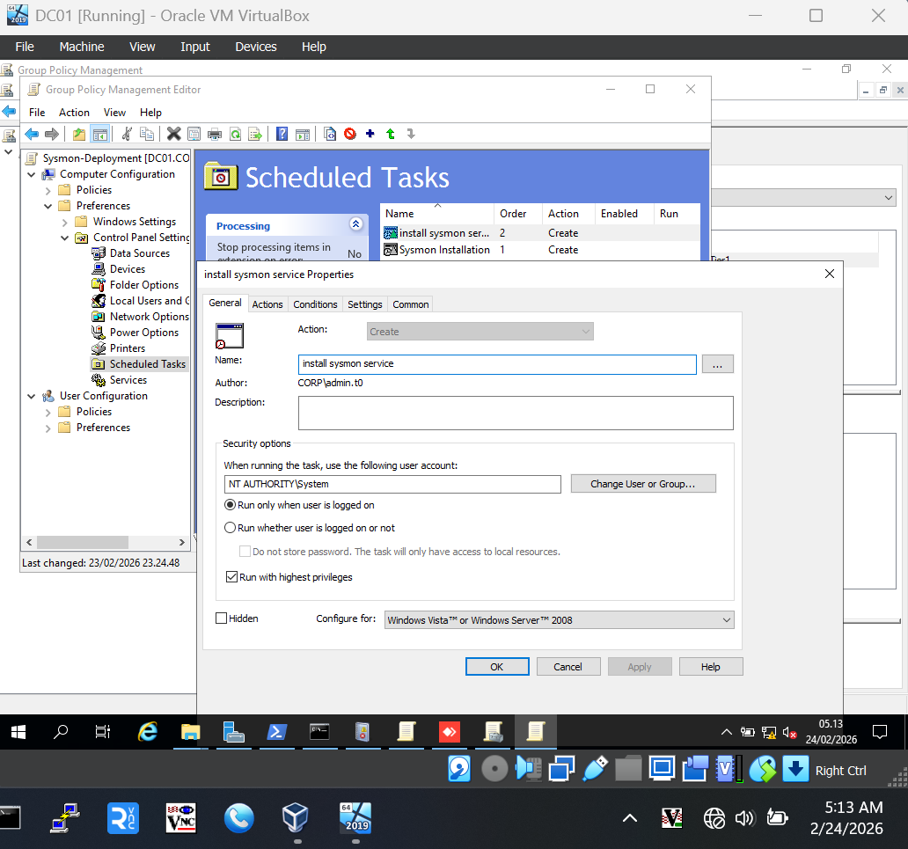
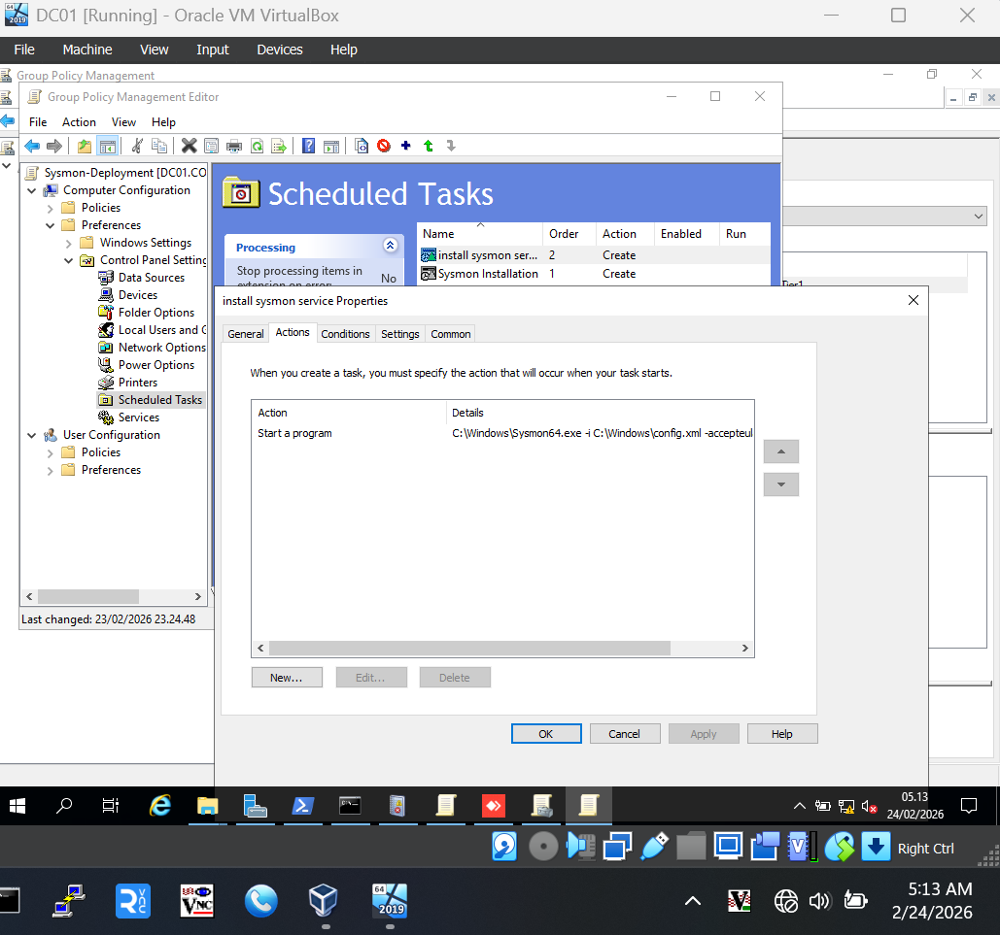
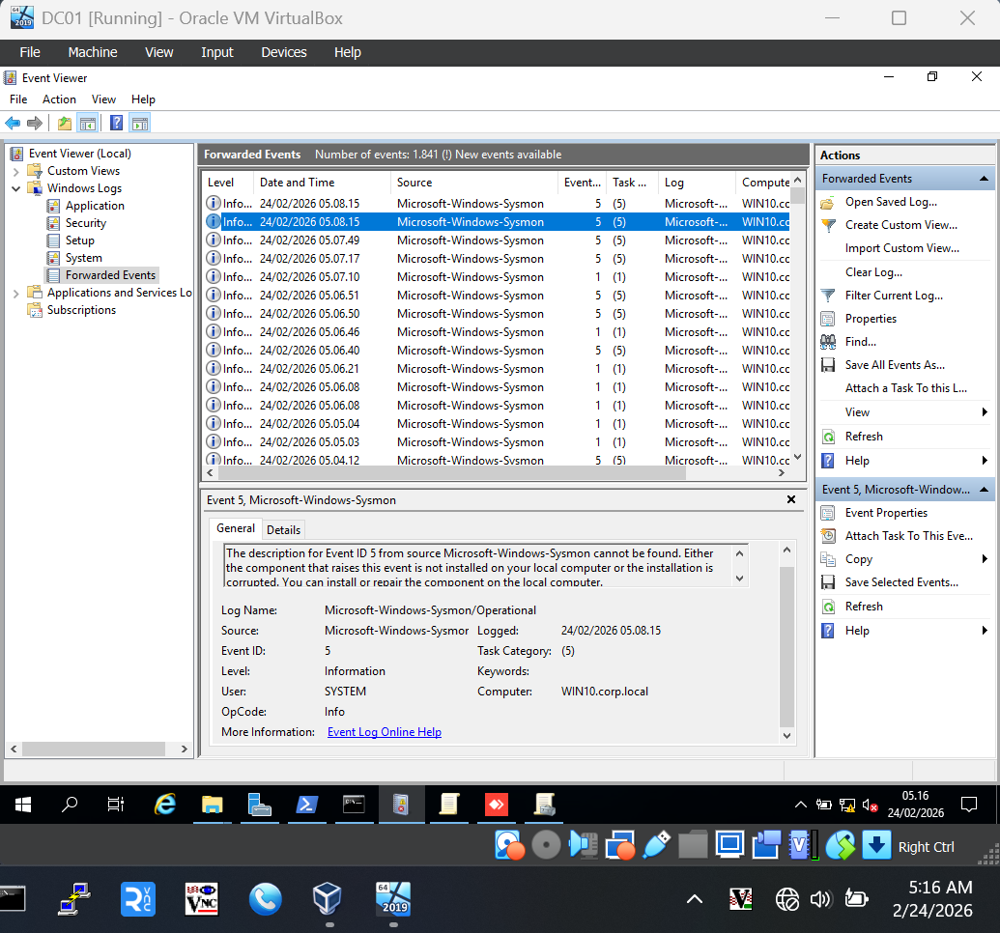
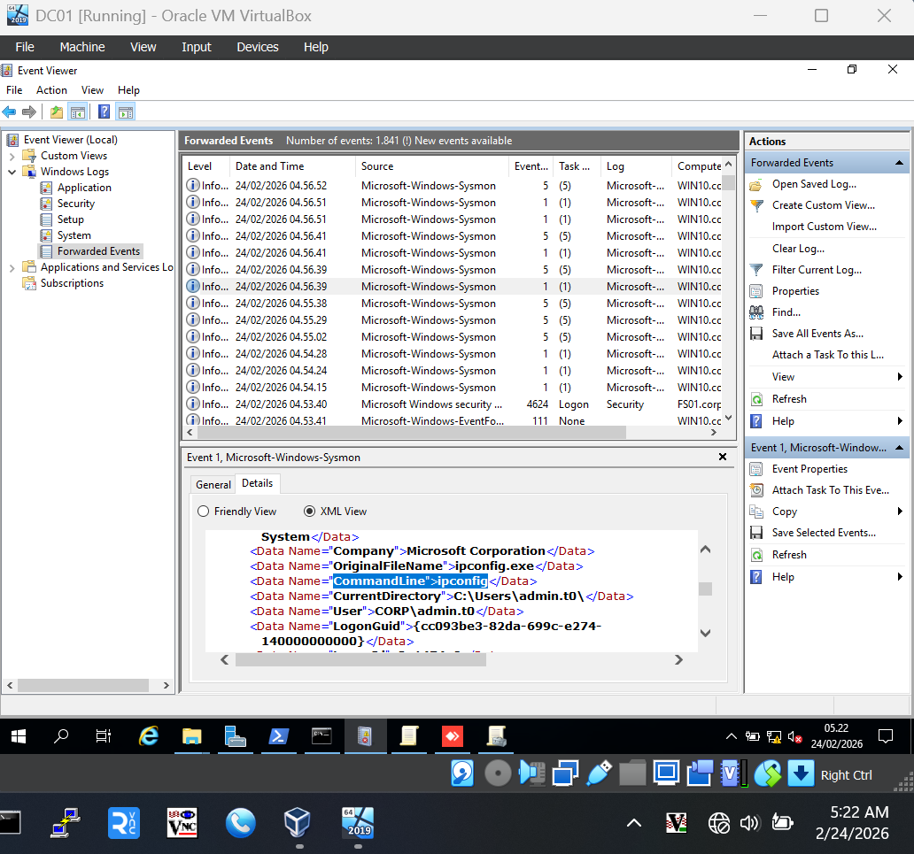
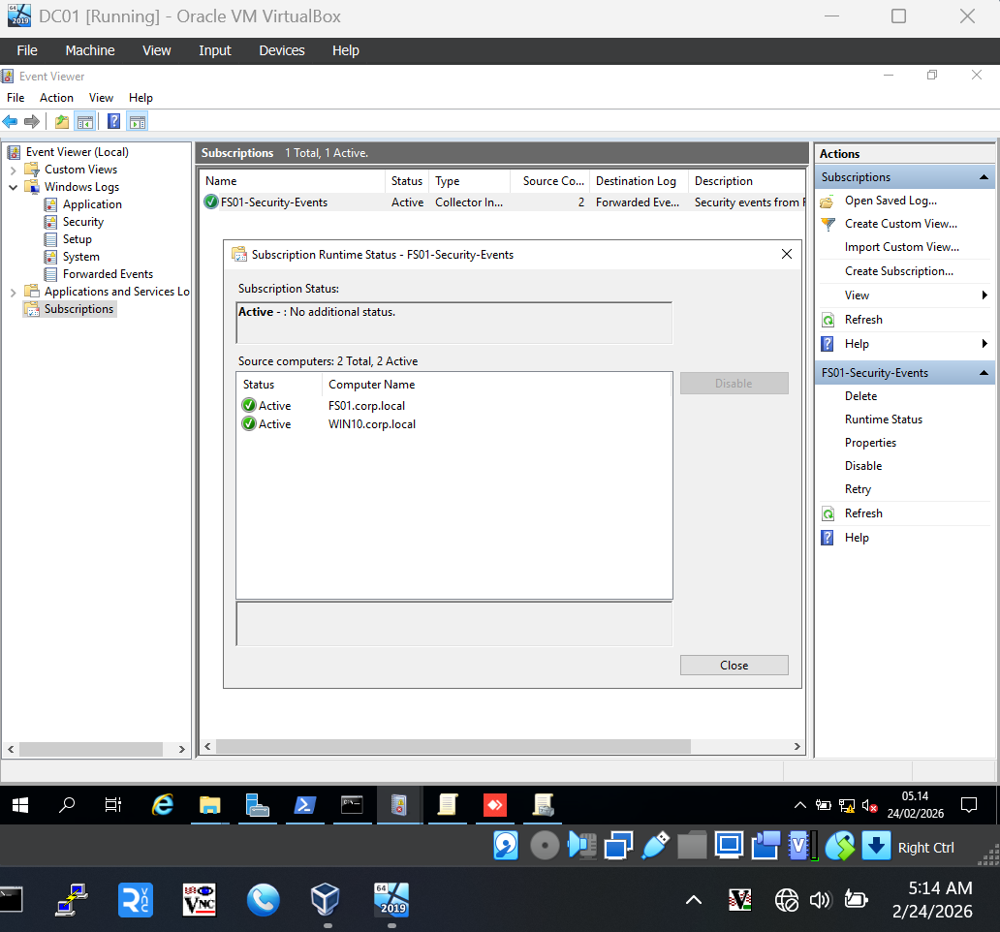
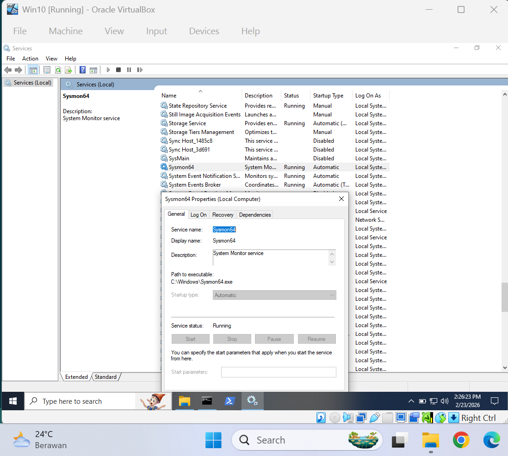
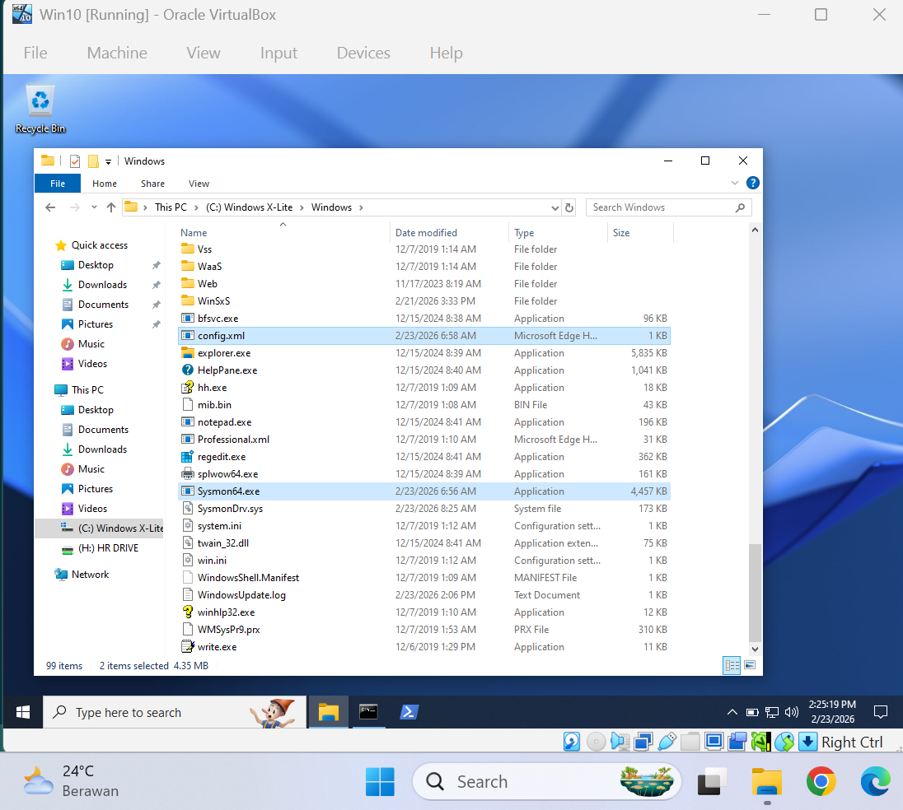

# Sub-Lab 10 – Sysmon Integration & Advanced Security Monitoring

## 📌 Objective

Deploy Microsoft Sysmon across the enterprise infrastructure to provide deep visibility into process activity, network connections, and file system modifications, and centralize these logs on DC01 using the existing WEF infrastructure.

Key objectives:

- Deploy Sysmon to **FS01** (Tier 1) and **WIN10** (Tier 2) via Group Policy.
- Configure Sysmon with a baseline for threat detection (e.g., SwiftOnSecurity).
- Update DC01 Collector to pull Sysmon logs via WinRM.
- Validate process-level monitoring (Event ID 1) in DC01 Forwarded Events.
- Demonstrate advanced troubleshooting of cross-tier log forwarding.

---

## 🏗 Environment Context

- **Domain:** `corp.local`
- **Collector:** `DC01` (192.168.200.10)
- **Source Servers:** `FS01` (Tier 1), `WIN10` (Tier 2)
- **Transport:** WEF Collector-Initiated (HTTP/5985)
- **Authentication:** Machine Account (`CORP\DC01$`)

---

## 🏛 Integrated Architecture

```text
[ FS01 / WIN10 ]                     [ DC01 (Collector) ]
+-------------------------+          +-------------------------+
| Sysmon Service          |          | Event Collector Service |
| (Process/Net/File Logs) | --PULL-- | (Forwarded Events Log)  |
|                         |  WinRM   |                         |
| Microsoft-Windows-      |  :5985   | Subscription:           |
| Sysmon/Operational      | < DC01$  |   FS01-Security-Events  |
+-------------------------+          +-------------------------+
```

---

## 🛠 Implementation

### Phase 1: Preparation of Deployment Assets (DC01)

Assets are centralized on DC01 to ensure consistent deployment across all domain-joined machines.

- **Storage Path:** `C:\Deployment\Sysmon\`
- **Network Path:** `\\DC01\Deployment$\Sysmon\`
- **Permissions:** `Domain Computers` granted **Read** access.



### Phase 2: GPO Configuration (Tier1-Sysmon-Deployment)

A Group Policy is created to automate the lifecycle of the security agent.

| Setting                   | Configuration                                         |
| :------------------------ | :---------------------------------------------------- |
| **GPO Name**              | `Tier1-Sysmon-Deployment`                             |
| **Link Location**         | `OU=Tier1` (Servers) and `OU=Tier2` (Workstations)    |
| **Computer Pref / Files** | Copy `Sysmon64.exe` and `config.xml` to `C:\Windows\` |
| **Scheduled Task**        | **Immediate Task** ($SYSTEM$) to install the service. |







### Phase 3: WEF Subscription Update

The existing collector on **DC01** is updated to ingest the granular data generated by Sysmon.

**Log Path:** `Microsoft-Windows-Sysmon/Operational`







---

## 🔍 Validation Results

### Endpoint Verification (FS01/WIN10)

Successful deployment is confirmed by verifying the presence of the files in the system directory and the active status of the service.



### Forwarded Events (DC01)

The "Ground Truth" of the lab: Logs from WIN10 flowing into DC01 with full command-line visibility.

| Event ID | Description        | Insight Provided                                     |
| :------- | :----------------- | :--------------------------------------------------- |
| **1**    | Process Creation   | Full command-line transparency (e.g., `whoami /all`) |
| **3**    | Network Connection | Destination IPs and Ports (Beaconing detection)      |
| **11**   | File Create        | Detection of malware tool drops                      |



---

## ⚠ Challenges & Troubleshooting

| Issue                    | Root Cause                                               | Resolution                                               |
| :----------------------- | :------------------------------------------------------- | :------------------------------------------------------- |
| **File Copy Failure**    | GPO used local path (`C:\...`) instead of UNC.           | Changed to `\\DC01\Deployment$\Sysmon\...`               |
| **Access Denied (0x5)**  | Credential mismatch (Tier 1 `admin.t1` reaching Tier 2). | Switched subscription to **Machine Account (`DC01$`)**.  |
| **Service Not Starting** | Startup task failed because files were not yet ready.    | Changed to **Immediate Task** with `SYSTEM` credentials. |
| **WIN10 Logs Missing**   | WIN10 was not a member of the Subscription source.       | Manually added `WIN10.corp.local` as a source machine.   |

---

## 🧠 Project Interconnections

- **Identity & OUs (Lab 06/07):** Deployment is scoped to Tier OUs, maintaining privilege boundaries.
- **Security Baseline (Lab 08):** Enhances basic auditing by providing deep forensic telemetry.
- **Centralized Monitoring (Lab 09):** Lab 10 provides the high-value "Content" for the "Container" built in Lab 09.

---

## 🛠 Skills Demonstrated

- **EDR Fundamentals:** Implementing Sysmon as a primary host-based monitoring layer.
- **Automated Deployment:** Managing software lifecycle via GPO and Scheduled Tasks.
- **Advanced WEF Operations:** Resolving cross-tier permission and authentication conflicts.
- **Documentation Standards:** Professional reporting of implementation and troubleshooting.
